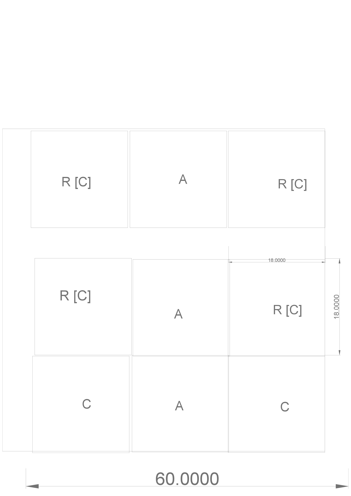

<link rel="stylesheet" href="css/main.css"/>

# Tiny Village

## Goals

Goals are to improve food security, land use, as well as energy and resource efficiency, reduce commute times, reduce injury and deaths from vehicle accidents, and overall increase quality of life.

## Subvivision of Surburban Lots

The core idea is to subdivide each  residential surburban 
lot into 9 lots.  Given a typical lot size of 60'x60',
that means each plot is 18'x18' with two 6' passages.

## Subdivision Zoning

Mixed-use zoning helps implement the project goals.  Each 
subdivision is required to contain the following zones:

* 4 residential (optionally with commercial in the same space)(R [C])
* 3 high-tech agricultural (co-op or commercial)
* 2 commercial

This zoning ensures that each subdivision has a minimum of 
agricultural space, commercial space, and also encourages people
to run businesses out of their homes.  Structure height is limited
to a maximum of two stories.

## Passive Tiny Homes

Regulations for residential construction can specify 
passive/efficient requirements such as maximal insulation, airtight 
construction with HRV, cooling tubes or heat pump, solar,
energy storage, greywater recyling, etc. 

Separate structures will reduce noise pollution and increase
privacy when compared to attached units.

## Localizing Food Production

Regulations can specify efficient agricultural methods such as
advanced permaculture, aquaponics, aeroponics, hydroponics, 
and vertical farming.

## Village Sections

Ideally several suburban plots together are each subdivided.
For example, to start small, suppose six homes at one end of a
street convert.  What was originally just 6 large residences 
becomes 24 tiny homes(/businesses), 18 agricultural spaces,
and 12 commercial spaces, for a total of 54 spaces.  Land use
is improved by 800%.  

## Road Safety

This part of the street is barricaded to prevent normal vehicle traffic from entering.

To improve safety and reduce noise pollution in village areas:
 
* combustion engines are prohibited
* maximum vehicle weight including passengers and cargo is 300 pounds
* maximum speed is 25 mph 
* human powered transport like bicycles, recumbant trikes, and velomobiles are encouraged

 
